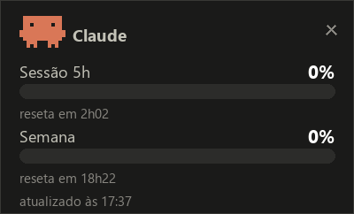

# Monitor de uso do Claude

Widget flutuante (Windows 11) com os percentuais **reais** do plano Claude — sessão 5h e semana, os mesmos números do `/usage` — sem abrir o app Claude.

<p align="center">
  
</p>

## Como funciona

```
Claude Code ──stdin──▶ statusline.py ──▶ ~/.claude/usage-monitor/rate_limits.json ──▶ widget.pyw
```

- `statusline.py`: configurado como `statusLine` em `~/.claude/settings.json`. A cada refresh do Claude Code, grava os `rate_limits` oficiais e mostra `[Modelo] · ctx X% · 5h Y% · sem Z%` no rodapé do Claude Code.
- `widget.pyw`: janela sempre-no-topo (Tkinter, stdlib pura) com 2 barras, countdown de reset, carimbo de atualização e o mascote. Arrastável (posição persiste); clique-direito → Fechar; instância única.
- **Zero rede, zero token**: só o canal oficial e documentado da statusline.

## Instalar / religar

```powershell
powershell -ExecutionPolicy Bypass -File install.ps1
```

Cria o atalho na pasta Startup (auto-start no logon) e inicia o widget. Desinstalar: apagar o atalho `Claude Usage Monitor.lnk` da pasta Startup (`Win+R` → `shell:startup`).

## Limitações conhecidas (v1)

- Atualiza enquanto algum Claude Code roda (statusline é event-driven); parado, congela no último valor com aviso "parado há X".
- A statusline só ativa em **sessão nova** do Claude Code, e `rate_limits` só chega após a 1ª resposta da sessão.
- Sem sub-quotas semanais por modelo (a statusline oficial não as entrega).
